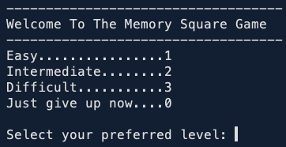
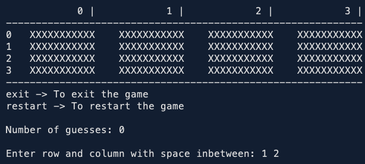
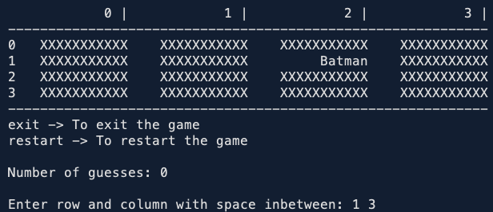
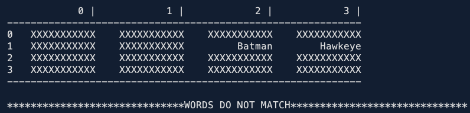
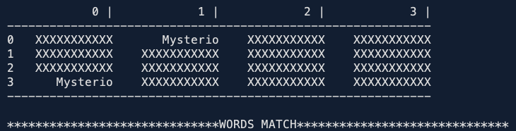
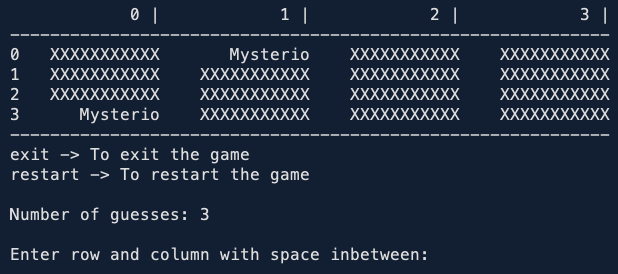
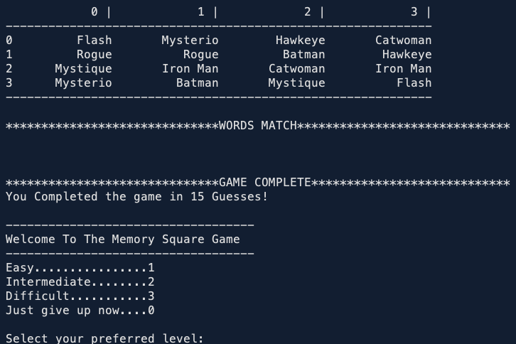

# Memory-Game
 **Object Oriented Programming Coursework, Second Year of Computer Science**

 ##Scenario
For this simplified version of the game that uses words rather than pictures, there is just a single player and the aim is to match all the pairs of words in the fewest number of guesses. The game has three levels of difficulty based simply on the number of words arranged in the grid, i.e., taken from the small, medium, or large list of words provided in the (read-only) data files.

   Below is the main menu of the game

   

 1. Program presents the User with a console-based game to interact with the data set.
   The prompt will loop until the User enters zero to exit (e.g. as illustrated below)

   

 2. In the game, the user can simply exit the program by entering 'exit'. I will demonstrate the 'Easy' below. 

 - &emsp; Step 1 below shows the start of the game.

   &emsp;&emsp; 

 - &emsp; Step 2 below shows a card when the user enters a correct index to display (i.e. '1 2' in this case)

   &emsp;&emsp; 

 - &emsp; Step 3 below shows an incorrect match. Other error-handling methods used are: 
 - &emsp;&emsp; Not allowing the user to pick the same index as the first card chosen for the second card
 - &emsp;&emsp; Not allowing the user to choose an already matched card
 - &emsp;&emsp; Ensuring the index chosen is within bounds

   &emsp;&emsp; 
   
 - &emsp; Step 4 below shows a match found by the user

   &emsp;&emsp; 
   
 - &emsp; Step 5 below shows matched cards facing up.

   &emsp;&emsp; 
   
 - &emsp; Step 6 below shows the event upon game completion

   &emsp;&emsp; 
